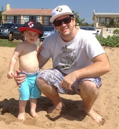

<!--
template = page
title = About Me
menu = about
-->

Hi, my name is Luke. I'm a husband, a dad and a developer
who lives in [Durban, South Africa](http://www.durbanexperience.co.za/Pages/default.aspx).

You can email me at <lukev@lukev.net> or reach out on:

* <a href="http://twitter.com/lukevenediger" title="@lukevenediger's tweets"><i class="icon-twitter"></i>&nbsp;Twitter @lukevenediger</a></li>
* <a href="https://github.com/lukevenediger" title="See my projects and profile on Github.com"><i class="icon-github"></i>&nbsp;Github</a>
* <a href="http://www.linkedin.com/in/lukevenediger" title="Find me on LinkedIn"><i class="icon-linkedin"></i>&nbsp;LinkedIn</a>

## Attribution
* Built with [champ](https://github.com/lukevenediger/champ), a neato static site generator for windows users.
* Thanks to [Momentum Design Lab](https://momentumdesignlab.com/) for the favicon.
* Thanks to [github](https://github.com/) for the hosting facilities.